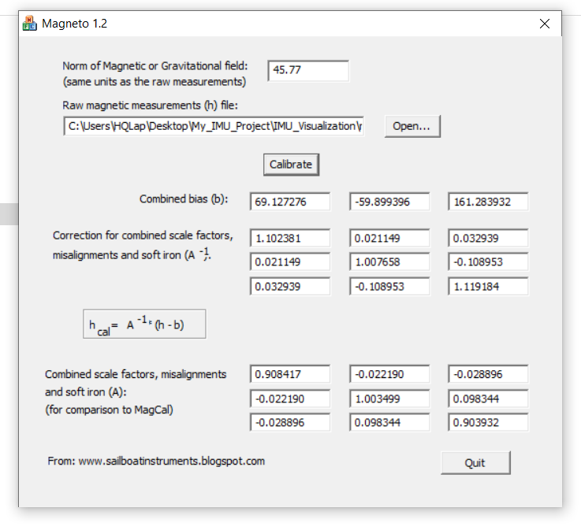
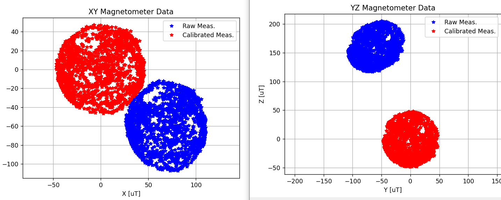

# Madgwick Algorithm implementation with Bosch's Bno055 sensor
Quaternion Based Attitude Estimation Using Bno055 and STM32F407


[DEMO](https://www.youtube.com/watch?v=e6xahf8quOc)

# Hardware
- [STM32F407G-DISC1](https://www.st.com/en/evaluation-tools/stm32f4discovery.html)

- [ESP32](https://www.espressif.com/sites/default/files/documentation/esp32-wroom-32e_esp32-wroom-32ue_datasheet_en.pdf) streaming data over serial instead of using USB-to-Serial Converter

- [BNO055](https://www.bosch-sensortec.com/products/smart-sensor-systems/bno055/) (probably made in China)


# Connections

| BNO055            | STM32 Pin   |   | STM32 Pin         | ESP32       |
|-------------------|-------------|---|-------------------|-------------|
| SCL               | PB10        |   | PA2 (UART2 TX)    | GPIO3 (RX)  |
| SDA               | PB11        |   | PA3 (UART2 RX)    | GPIO1 (TX)  |
| GND               | GND         |   |                   |             |
| VIN               | 3V          |   |                   |             |

# Frame Representation
To change the frame to ENU Frame, in Sensor_Init() function set:
```
handle_bno055.Frame = ENU_FRAME;				
```
in order to config the frame of BNO055 and Madgwick Algorithm also.

# Madgwick Algorithm
* The first estimation was calculated by ecompass() function (Accelerometer and Magnetometer Fusion)
* Delta time (default 0.0125s (80 Hz) -> use a timer interrupt)
    - To calculate the required delta time use the `timer_period_calculation.xlsx` file and change the parameters in TIMER6_Init() with this results
* Set up the filter Beta gain (default 0.68)

# Raw Measurement and Calibrated
By default, this implementation uses raw accelerometer and gyroscope data along with custom calibrated magnetometer data.
To manually calibrate the magnetometer, follow these steps:
* In the Timer interrupt callback function, modify it as follows:
```
void HAL_TIM_PeriodElapsedCallback(TIM_HandleTypeDef *htim)
{
	if (htim == &htimer6){

		ReadData(&BNO055,  SENSOR_MAG);

	    len = snprintf(msg, sizeof(msg),
	        "%f,%f,%f\n",
			BNO055.Magneto.X, BNO055.Magneto.Y, BNO055.Magneto.Z);  
	    SERIAL_Printf(msg);

    }
}
```
* On the PC side, run the `log-mag.py` script and rotate the sensor as much as possible to collect the raw magnetometer data.
* Open [Magneto12.exe](https://sailboatinstruments.blogspot.com/2011/09/improved-magnetometer-calibration-part.html) software to find the Bias & Scale factor Matrices



* Copy the 3x1 bias matrix (B) and the 3x3 inverse scale factor matrix (A⁻¹) into `plot-calibration-data.py` to get the comparison



* Update the 3x1 bias matrix (B) and the 3x3 inverse scale factor matrix (A⁻¹) on the STM32 side
```
// Magnetic bias vector
float Mag_Bias[3] = {69.127276f, -59.899396f, 161.283932f};

// Magnetic scaling factor matrix
float Mag_ScFactor[3][3] = {
    {1.102381f, 0.021149f, 0.032939f},
    {0.021149f, 1.007658f, -0.108953f},
    {0.032939f, -0.108953f, 1.119184f}
};
```

# BNO055's Automatic Background Calibration
