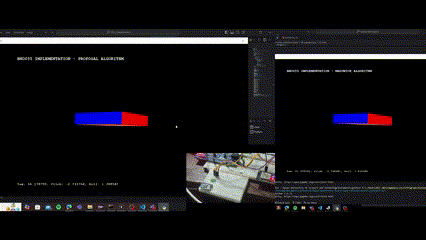
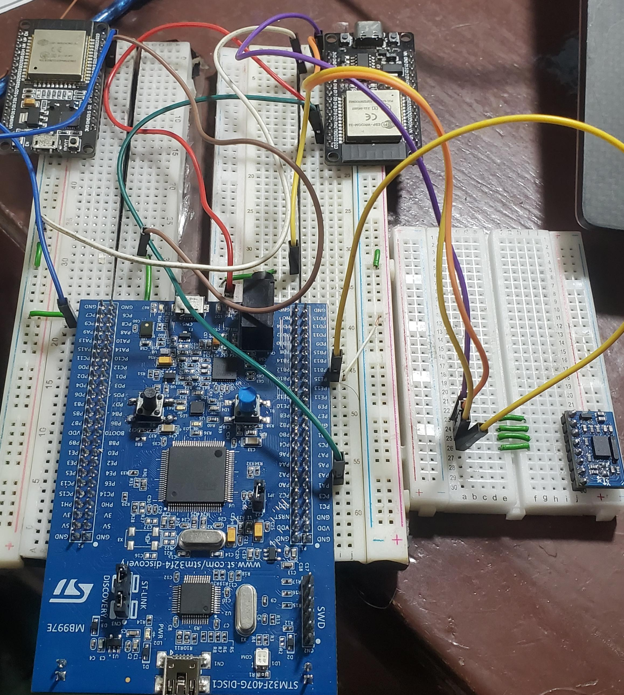

# Madgwick Algorithm implementation with Bosch's Bno055 sensor
Quaternion Based Attitude Estimation Using Bno055 and STM32F407

Board used is:
- [STM32F407G-DISC1](https://www.st.com/en/evaluation-tools/stm32f4discovery.html)

- [ESP32](https://www.espressif.com/sites/default/files/documentation/esp32-wroom-32e_esp32-wroom-32ue_datasheet_en.pdf) streaming data over serial instead of using USB-to-Serial Converter

# Circuit:

# Connections

<table>
    <tr>
        <th>BNO055</th>
        <th>STM32 Pin</th>
    </tr>
    <tr>
        <td>SCL</td>
        <td>PB10</td>
    </tr>
    <tr>
        <td>SDA</td>
        <td>PB11</td>
    </tr>
    <tr>
        <td>GND</td>
        <td>GND</td>
    </tr>
    <tr>
        <td>VIN</td>
        <td>3V</td>
    </tr>
</table>

&nbsp; 

<table>
    <tr>
        <th>STM32 Pin</th>
        <th>ESP32</th>
    </tr>
    <tr>
        <td>PA2 (UART2 TX)</td>
        <td>GPIO3 (RX)</td>
    </tr>
    <tr>
        <td>PA3 (UART2 RX)</td>
        <td>GPIO1 (TX)</td>
    </tr>
</table>

